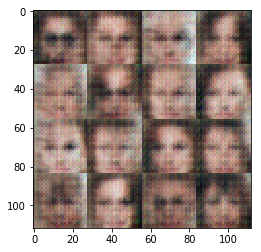

# Human Face Generator
 -Implimentation of Deep Convolutional Generative adversarial networks to generate Human Face
 
 -Based on Large-scale CelebFaces Attributes (CelebA) Dataset
 
 ### Example of Generated Face after only ONE epoch:
 
 
